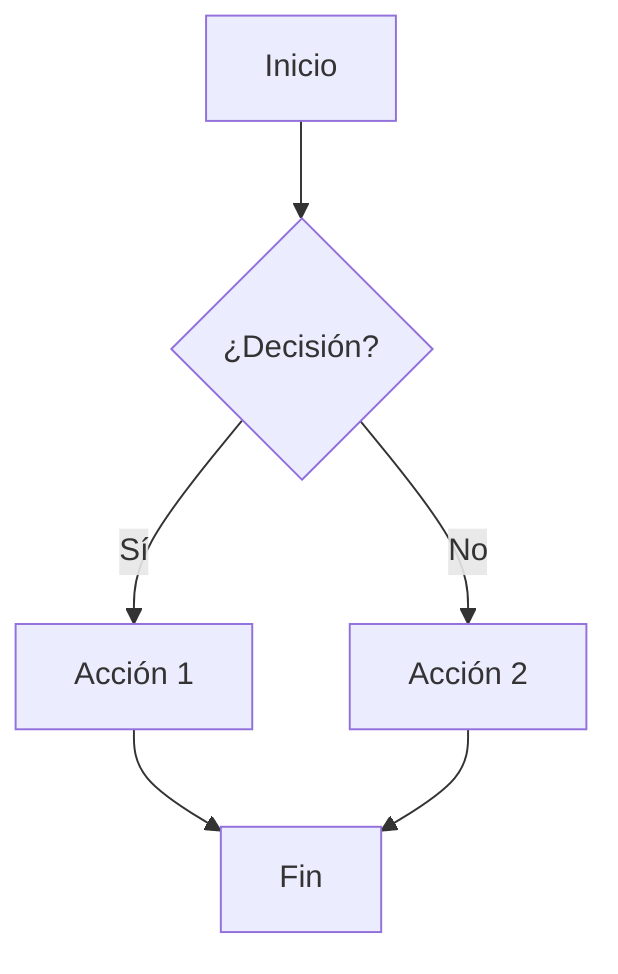
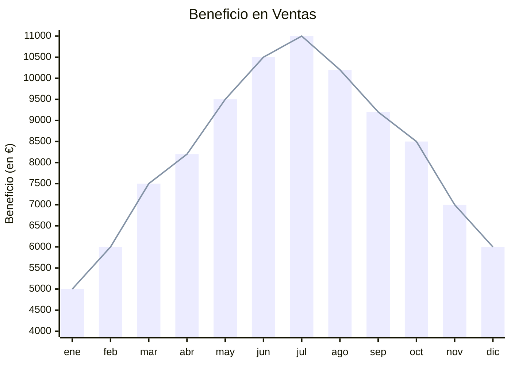

# Encabezado
## Conexion con titulos
Ir a la seccion de: 
- [imagenes](#imagenes)

- [Cursiva](#Cursiva)
- [Texto tachado](#texto-tachado)

- [Lista Ordenada](#listas-ordenadas)

---

**Negrita con asterisco**

__Negrita con barra baja__

---

## Cursiva

*un asterisco*

_hfse_

---

## Negrita y cursiva

***Negrita y cursiva***

___También negrita y cursiva___

---

## Texto tachado
~~Texto tachado~~

---

## Codigo en linea
`USAR ACENTOS PARA ESTE`

---

> CITA o Bloque
> Multiples lineas

## Listas Desordenadas
- item 1
- item 2
+ item con suma
* item con asterisco

---

## Listas Ordenadas
1. Hola
2. ad w

## Listas de tareas completadas

 - [x] wada 
  - [ ] wada 
 - [ ] wada 

> Tambien dentro de esto desmadre, se puede poner listas
- __[Youtube](https://www.youtube.com/watch?v=EHUkxgbj0TQ)__

- [ChatGPT](https://chatgpt.com/c/6912077a-74fc-8326-b003-f715d0c65ab4 "Ir a ChatGPT") 

---

## Enlaces de referencia

Este es un [enlace de referencia][1], y este es [otro][2]

[1]: (https://chatgpt.com/c/6912077a-74fc-8326-b003-f715d0c65ab4)

[2]: (https://chatgpt.com/c/6912077a-74fc-8326-b003-f715d0c65ab4)

---
## Enlaces automaticos
<https://chatgpt.com/c/6912077a-74fc-8326-b003-f715d0c65ab4>

### Enlaces de secciones

[Ir a la seccion de imagenes](#imagenes)

## imagenes
Foto xddddddddddd

---

## Contacto 
> Utilizar mailto

[Contactame](mailto:correo@ejemplo.com)

## Tablas

|Columna 1 | Columna 2 | Columna 3|
|:----------|:--------:|--------:|
| Sexo | Sexo | Sexo |

   > :--- = Alineado a la izquierda
    
    >   :---: = Centrado
    
    >   ---: = Alineado a la derecha

### Tres formas diferentes de crear una línea horizontal

---
***
___

<dl>
  <dt>Git</dt>
  <dd>Sistema de control de versiones distribuido</dd>
  
  <dt>Markdown</dt>
  <dd>Lenguaje de marcado ligero</dd>
</dl>

<dl>	Definition List	Contiene toda la lista de definiciones.
<dt>	Definition Term	Es el término que se va a definir (como una palabra en un diccionario).
<dd>	Definition Description	Es la descripción o definición del término anterior.

\* No será un item de lista

\# No será un encabezado

\[No será un enlace\]

<!-- Este es un comentario que no se verá -->

:smile: 

## Mermaid

Mermeid, ejericio [aquì](https://mermaid.live/edit#pako:eNpFkEtvgzAQhP-KteqRROaVYKuK1EByrCo1pwYOVnDACtiRY9QH8N-7EDX1yfPtzI7lHk6mlMDh3JjPUy2sI4cs1-TluNPOitbciFNSl6Igi8Vm2-9uRKuLHNGyncjwrgaS9gfRNGKC6Qw3ER2y_s3KkzL_9BnpLteos7uO6dNA9sfUtNe5qiCP2SamA0HzflL30L3v1SA_7pUuJoiYgAeVVSVwZzvpQSttKyYJ_TTNwdWylTlwvJbCXnLI9YiZq9AfxrR_MWu6qgZ-Fs0NVXcthZOZEhU-7EEtfoS0qem0Ax6H8bwEeA9fwEMWLtcxXVOf0ShgK-bBN5rYMmB-sE6SkPm-H4ajBz9zK10maMcTRKtkxWI_Gn8B2QF43w)

## Sequencia de diagrama con mermaid
Ir [aquì](https://mermaid.live/edit#pako:eNplUDtvgzAQ_ivWzZBgIAQ8ZEipKnVo1cdUeXHBSVCCTc-21DTKf6-JCCmqb_F99z1Od4JK1xIYGPnlpKpk2YgtiparTqBtqqYTyhJnnMBGT8ENamVDqeop_Cmq_T-wXHPF1WBDwtVqFDOjD55lBamF1YarcdLTBjP2cP9O5qJr5gNpwHtKuWYvTuKxDyjXJPyjepXGHayoJ4pJ-OPb89Mk0k-HLVnrpLE47nUrQiCALTY1MItOBtBKbEXfwqmfcrA72UoOzH9rgXsOXJ29xp_iQ-v2KkPttjtgG3EwvnOdD7qef0TRbyXxTjtlgVGaZhcXYCf49n2-mC0X0ZIuaZZE-aJIAzh6OEtncUHjIorzJI4SGp8D-LkER7PcC_xL46TIsqig519O8K2_)

--- 

## Gantt en mermaid
Ir al sitio [aqui](https://mermaid.live/edit#pako:eNptUEtOwzAQvcpo1kllOx8n3iGisip7UDajxqQRiV05DqJUPRRn4GI4TVtA4q3m8z72HHFrG40KWzLe1wYCfOd7DXfwMI-g6qh1NCyrhrxeWzeQB3gKiDebuKqW3ai3vrMG1jRq4LAMq27UX58WDtDokZyzfW9hgSIegWAiizmPWagT1tTmHy_x1-osFRHQi9cOiANcpPPmMWSQ795oiQBKrhkiFiwCnl2I1c9zAiu92SW_zGqDEbaua1B5N-kIBx2-Prd4nBk1-p0edI0qlA251xprcwqaPZlna4erzNmp3aF6oX4M3bSfr3g5623qtGm0u7eT8ai4lOnZBdUR31HJdJUXMuOZyApZlCyP8IBKlOVKSClZWeasTGR2ivDjHMtWgc0C0qQoRZnz_PQNFV-OOw)

## Cuadrante gràfica

Ir a la gràfica [aquí](https://mermaid.live/edit#pako:eNplj91ugzAMhV8l8jUgfgPkYlJ_nmJLLzzwgI4kXQgVXdV3H3RqhzRf-Xw-PpavUJmaQMDXiLVF7XYtWie161xPDPsKdUVSTz5O3cC2eDQP6PsvbNO7p2ZSX35dvzbSDTakSDv2tP4xqaV-nPQjtqd3sh0qMzCaTqjrzmozrCwxO1mjzJnsCibMEp2xH3FNU6boaOzCpK5QzXEtso1gb2GQeGHADyu8veM081gYxMn_SZYvE14ewIPGdjUIZ0fyQJFVuEi4Ss2YBNfOf0kQc1uj_ZQg9W3embNejVGPNWvGpgXxgf0wq_FUo6N9h41F9aSWdE12Z0btQMQZj-8pIK4wgYiSOMhSHhZRlsYlL_LMgwuINA2WPkyKKOVlHnN-8-D7fjgMijwt55oNSVHEEb_9AFOLoyM)

## Grafica de Barras

<h1>Titulo Centrado</h1>
<td></td>

<kbd>Ctrl</kbd> + <kbd>C</kbd> para copiar
Superíndice y subíndice

<mark>Texo subrayado</mark>

<table>
<tr>
    <td>celda</td>
        <td>awdwad</td>
    <td>adada</td>

</tr>

</table>